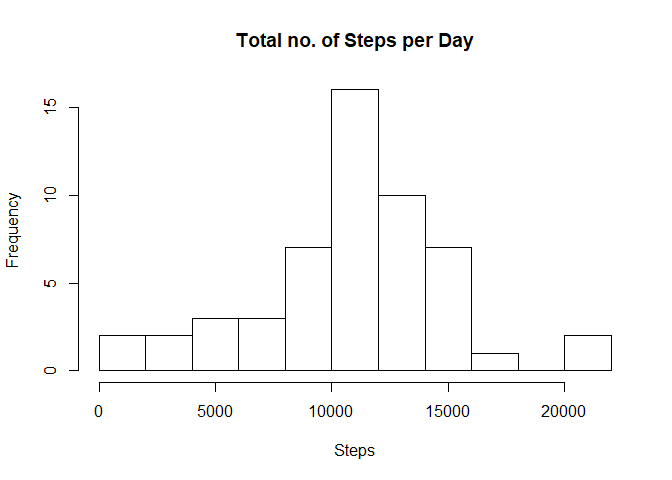
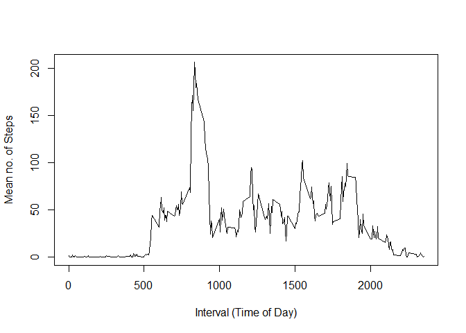
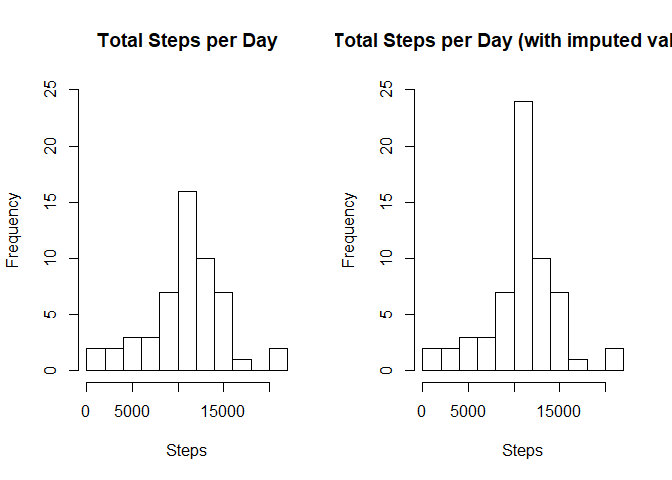
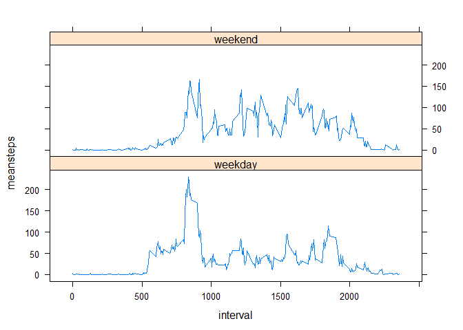

## Introduction

It is now possible to collect a large amount of data about personal movement using activity monitoring devices such as a Fitbit, Nike Fuelband, or Jawbone Up. These type of devices are part of the "quantified self" movement - a group of enthusiasts who take measurements about themselves regularly to improve their health, to find patterns in their behavior, or because they are tech geeks. But these data remain under-utilized both because the raw data are hard to obtain and there is a lack of statistical methods and software for processing and interpreting the data.

This assignment makes use of data from a personal activity monitoring device. This device collects data at 5 minute intervals through out the day. The data consists of two months of data from an anonymous individual collected during the months of October and November, 2012 and include the number of steps taken in 5 minute intervals each day.

The data for this assignment can be downloaded from the Coursera Reproducible Research course web site.

The variables included in this dataset are:

* steps: Number of steps taking in a 5-minute interval (missing values are coded as 'NA')
* date: The date on which the measurement was taken in YYYY-MM-DD format
* interval: Identifier for the 5-minute interval in which measurement was taken

The dataset is stored in a comma-separated-value (CSV) file and there are a total of 17,568 observations in this dataset.

## Loading and preprocessing the data

The data is sourced and loaded as follows:

```r
### Check to see if data is in working directory and load the data
if (file.exists("activity.zip") == FALSE){
  fileurl <- "https://www.coursera.org/learn/reproducible-research/peer/gYyPt/course-project-1"
  download.file(fileurl, destfile = "./activity.zip")
}

data <- read.csv(unzip("activity.zip"),header = TRUE, na.strings="NA")
```
Note that to simplify working with the data and later plotting I do not process or reformat the interval data, thus an interval value of 0 in the analysis equates to a interval (time) of 00:00 and an interval 835 equates to 08:35, etc.

## What is mean total number of steps taken per day?

The totals for the number of steps taken each per day is indicated in the histogram below.


```r
### Calculate the total number of steps each day
daytotalsdata <- tapply(data$steps, data$date, sum)
daytotals <- as.data.frame(daytotalsdata)
daytotalsdays <- as.Date(row.names(daytotals)) 
daytotals <- cbind(daytotalsdays,daytotals)
colnames(daytotals) <- (c("day", "steps"))

### Make a histogram of the total number of steps taken each day
hist(daytotals$steps,breaks=10, main = "Total no. of Steps per Day", xlab = "Steps")
```

<!-- -->

```r
### Calculate and report the mean and median of the total number of steps taken per day
meansteps <- as.integer(mean(daytotals$steps, na.rm = TRUE))
mediansteps <- as.integer(median(daytotals$steps, na.rm = TRUE))
print(meansteps)
```

```
## [1] 10766
```

```r
print (mediansteps)
```

```
## [1] 10765
```
The mean number of steps taken per day is 10766.
The median number of steps taken per day is 10765.

## What is the average daily activity pattern?

The average daily pattern is indicated in the plot below.

```r
### Make a time series plot of the 5-minute interval (x-axis) and the average number of steps taken, averaged across all days (y-axis)

intervalmeans <- as.data.frame(tapply(data$steps, data$interval, mean, na.rm = TRUE))
intervaldata <- row.names(intervalmeans)
intervalmeans <- cbind(as.numeric(intervaldata),intervalmeans)
colnames(intervalmeans) <- (c("interval", "meansteps"))

with(intervalmeans, plot(meansteps ~ interval, ylab = "Mean no. of Steps", xlab = "Interval (Time of Day)", type = "l"))
```

<!-- -->

```r
maxinterval <- names(which.max(intervalmeans$meansteps))
print(maxinterval)
```

```
## [1] "835"
```
The interval (time period) with the greatest mean number of steps is 835.

## Imputing missing values


```r
### Calculate and report the total number of missing values in the dataset
missingvalues <- missingvalues <- sum(is.na(data$steps))
print(missingvalues)
```

```
## [1] 2304
```
The total number of missing values for the steps variable in the data is 2304.

I use the calculated mean value for each interval to impute values for of these 2304 missing entries. 


```r
### Create a new dataset that is equal to the original dataset but with the missing data filled in.
data2 <- data

for (i in 1:length(data2$steps)){
  if(is.na(data2$steps[i]) == TRUE){
    data2$steps[i] <- as.numeric(intervalmeans[which(as.numeric(data2$interval[i]) == intervalmeans[,1]),2])
  }
}
```
The total number of steps taken each per day using the updated dataset (i.e. including imputed values in place of missing values) is indicated in the histogram below.


```r
### Make a histogram of the total number of steps taken each day 
daytotalsdata2 <- tapply(data2$steps, data2$date, sum)
daytotals2 <- as.data.frame(daytotalsdata2)
daytotalsdays2 <- as.Date(row.names(daytotals2))
daytotals2 <- cbind(daytotalsdays2,daytotals2)
colnames(daytotals2) <- (c("day", "steps"))

par(mfrow=c(1,2))
hist(daytotals$steps,breaks=10, main = "Total Steps per Day", xlab = "Steps", ylim=c(0,25))
hist(daytotals2$steps,breaks=10, main = "Total Steps per Day (with imputed values)", xlab = "Steps",ylim=c(0,25))
```

<!-- -->

```r
### Calculate and report the mean and median total number of steps taken per day.
meansteps2 <- mean(daytotals2$steps, na.rm = TRUE)
mediansteps2 <- median(daytotals2$steps, na.rm = TRUE)
print(meansteps2)
```

```
## [1] 10766.19
```

```r
print (mediansteps2)
```

```
## [1] 10766.19
```
Using the dataset with imputed values inserted, the mean total number of steps taken per day is 1.0766189\times 10^{4}. The median total number of steps taken per day is 1.0766189\times 10^{4}. 

The mean total number of steps is therefore not changed using this imputation method, while the median total number of steps differs only slightly.

## Are there differences in activity patterns between weekdays and weekends?


```r
### Create a new factor variable in the dataset with two levels - "weekday" and "weekend" indicating whether a given date is a weekday or weekend day.
weekdays1 <- c()
for (i in 1:length(data2$date)){
  if(weekdays(as.Date(data2$date[i])) == "Saturday"){
    weekdays1 <- c(weekdays1, "weekend")} 
  else if(weekdays(as.Date(data2$date[i])) == "Sunday"){
    weekdays1 <- c(weekdays1, "weekend")}
  else{weekdays1 <- c(weekdays1, "weekday")}
}
weekdays1 <- as.factor(weekdays1)
data2 <- cbind(data2, weekdays1)
```
The average daily pattern, broken down by weekend days and weekdays, is indicated in the plots below.

```r
### Make a panel plot containing a time series plot of the 5-minute interval (x-axis) and the average number of steps taken, averaged across all weekday days or weekend days (y-axis).

data3 <- data2[data2$weekdays1 == "weekday",]
intervalmeans3 <- as.data.frame(tapply(data3$steps, data3$interval, mean, na.rm = TRUE))
intervaldata3 <- row.names(intervalmeans3)
intervalmeans3 <- cbind(as.numeric(intervaldata3),intervalmeans3,c(rep("weekday", 288)))
colnames(intervalmeans3) <- (c("interval", "meansteps", "weekdays1"))

data4 <- data2[data2$weekdays1 == "weekend",]
intervalmeans4 <- as.data.frame(tapply(data4$steps, data4$interval, mean, na.rm = TRUE))
intervaldata4 <- row.names(intervalmeans4)
intervalmeans4 <- cbind(as.numeric(intervaldata4),intervalmeans4, c(rep("weekend", 288)))
colnames(intervalmeans4) <- (c("interval", "meansteps", "weekdays1"))

data5 <- rbind(intervalmeans3,intervalmeans4)

library(lattice)
xyplot(meansteps ~ interval | weekdays1, data = data5, layout = c(1, 2), type = "l", scales = list())
```

<!-- -->

The histograms indicate a difference in the activity patterns during weekdays and weekends. Broadly speaking there is greater activity later in the day (between the hours of approximately 1000 and 2000) at weekends, compared to weekdays. 
